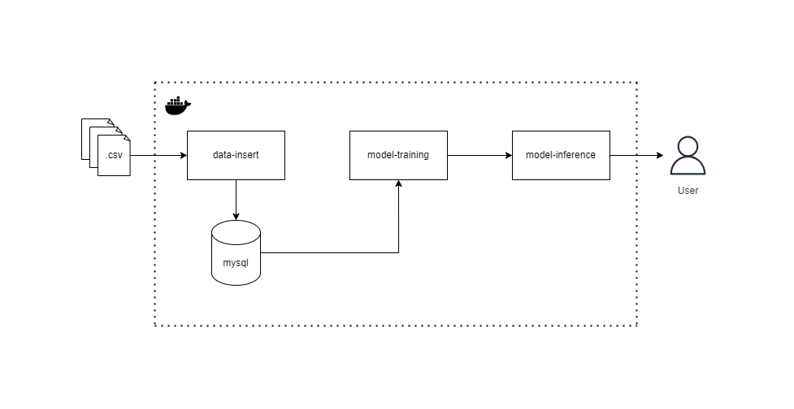

# Real state ML pipeline

## Solution architecture design



The solution has the following components:
- `data-insert` which takes .csv files and inserts them into MySQL;
- `mysql` is MySQL where training and testing data is stored;
- `model-training` which trains the ML model and writes the trained model binary;  
- `model-inference` which is the API for inference of the trained model.

The four components are provisioned locally with `docker-compose.yml`.

The project was developed with the following stack:
- `Python`: for creating scripts and implementing the solution;
- `Docker`: to containerize the solution;
- `MySQL`: SQL data base;
- `git`: for code versioning.

The project has the following repository structure:

```
real-state-ml-pipeline
├── README.md
├── data
│   ├── test.csv
│   └── train.csv
├── data-insert
│   ├── Dockerfile
│   ├── app
│   │   ├── main.py
│   │   └── models.py
│   └── requirements.txt
├── diagram
│   ├── diagram.drawio
│   └── diagram.png
├── docker-compose.yml
├── model-inference
│   ├── Dockerfile
│   ├── app
│   │   └── main.py
│   └── requirements.txt
├── model-training
│   ├── Dockerfile
│   ├── app
│   │   └── main.py
│   └── requirements.txt
├── models
│   └── trained_model.joblib
├── mysql
│   ├── Dockerfile
│   └── init
│       └── init.sql
└── src
    ├── __init__.py
    └── model_pipeline.py
```

## Code execution

To run this project, you need to clone the repository:

```bash
git clone https://github.com/plbalmeida/real-state-ml-pipeline.git
```

First run build and up `mysql`, `data-insert` and `model-training` components:

```bash
docker-compose up --build mysql data-insert model-training
```

To insert data into MySQL from a .csv file:

```bash
curl -X POST \
    "http://localhost:8000/properties/from-csv/" \
    -F "file=@data/train.csv"

curl -X POST \
    "http://localhost:8000/properties/from-csv/" \
    -F "file=@data/test.csv"
```

The following return is expected upon execution:

```bash
{
    "message":"16212 properties inserted successfully"
}

{
    "message":"6949 properties inserted successfully"
}
```

To run the model training component:

```bash
curl -X GET http://localhost:8001/train
```

The following return is expected:

```bash
{
    "message":"Model trained and saved successfully"
}
```

Now is possible to build and up the `model-inference` component:

```bash
docker-compose up --build model-inference
```

To make model inference:

```bash
curl -X POST \
    "http://localhost:8002/predict" \
    -H "Content-Type: application/json" \
    -H "X-API-Key: 1234567890abcdef1234567890abcdef" \
    -d '{
            "type": "house",
            "sector": "urban",
            "net_usable_area": 120.0,
            "net_area": 150.0,
            "n_rooms": 3,
            "n_bathroom": 2,
            "latitude": 40.7128,
            "longitude": -74.0060
        }'
```

The following return is expected with the price given the input variables:

```bash
{
    "prediction":[10450.683126723623]
}
```

To check API calls/predictions logs through the logger:

```bash
docker logs model_inference_container
```

The output expected:

```bash
2024-06-26 03:22:28,342 - app.main - INFO - Checking if model exists at /models/trained_model.joblib
2024-06-26 03:22:28,342 - app.main - INFO - Model found. Loading the model.
2024-06-26 03:22:31,138 - app.main - INFO - Model loaded successfully.
INFO:     Started server process [1]
INFO:     Waiting for application startup.
INFO:     Application startup complete.
INFO:     Uvicorn running on http://0.0.0.0:8000 (Press CTRL+C to quit)
2024-06-26 03:23:14,815 - app.main - INFO - Received API Key: 1234567890abcdef1234567890abcdef
2024-06-26 03:23:14,843 - app.main - INFO - Expected API Key: 1234567890abcdef1234567890abcdef
2024-06-26 03:23:14,843 - app.main - INFO - Request Time: 2024-06-26T03:23:14.808221
2024-06-26 03:23:14,847 - app.main - INFO - Request Client: 172.23.0.1
2024-06-26 03:23:15,360 - app.main - INFO - Input Data: {'type': 'house', 'sector': 'urban', 'net_usable_area': 120.0, 'net_area': 150.0, 'n_rooms': 3, 'n_bathroom': 2, 'latitude': 40.7128, 'longitude': -74.006}
2024-06-26 03:23:15,937 - app.main - INFO - Prediction: [10450.683126723623]
INFO:     172.23.0.1:34952 - "POST /predict HTTP/1.1" 200 OK
```

## Improvement points

- Automate the build and deployment process using CI/CD tools such as GitHub Actions;
- Create scripts to simplify the process of executing all steps;
- Configure centralized monitoring and logging for all services;
- Scale services as needed, ensuring high availability and performance;
- Iterate over the machine learning model to improve its accuracy and performance;
- Explore different algorithms and data preprocessing techniques;

## Contributions

Contributions are welcome. To contribute, please create a pull request for review.
